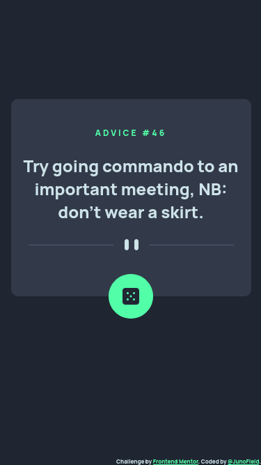
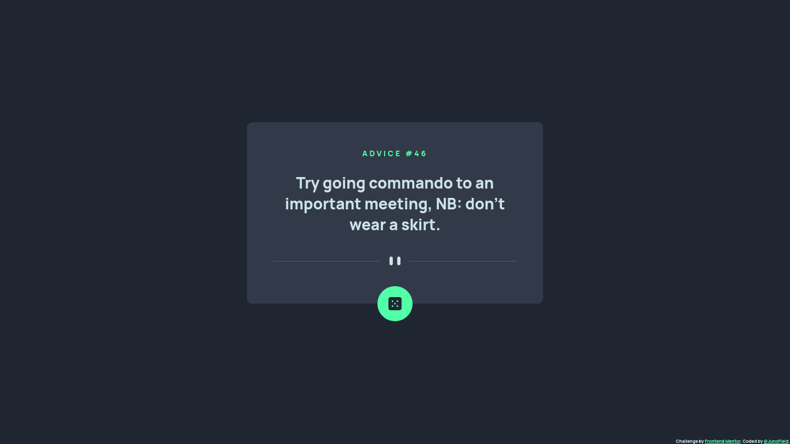

# Frontend Mentor - Advice generator app solution

This is a solution to the [Advice generator app challenge on Frontend Mentor](https://www.frontendmentor.io/challenges/advice-generator-app-QdUG-13db). Frontend Mentor challenges help you improve your coding skills by building realistic projects.

## Table of contents

- [Overview](#overview)
  - [The challenge](#the-challenge)
  - [Screenshot](#screenshot)
  - [Links](#links)
- [My process](#my-process)
  - [Built with](#built-with)
  - [What I learned](#what-i-learned)
  - [Continued development](#continued-development)
  - [Useful resources](#useful-resources)
- [Author](#author)
- [Acknowledgments](#acknowledgments)


## Overview

### The challenge

Users should be able to:

- View the optimal layout for the app depending on their device's screen size
- See hover states for all interactive elements on the page
- Generate a new piece of advice by clicking the dice icon

### Screenshot
#### Mobile


#### Desktop



### Links

- Solution URL: [https://github.com/JunoField/fmj4-advice-generator-app](https://github.com/JunoField/fmj4-advice-generator-app)
- Live Site URL: [https://junofield.github.io/fmj4-advice-generator-app](https://junofield.github.io/fmj4-advice-generator-app)

## My process

### Built with

- Semantic HTML5 markup
- CSS custom properties
- Flexbox
- [Advice Slip JSON API](https://api.adviceslip.com/)
- Mobile-first workflow


### What I learned

This was my first time using the "fetch" command to retrieve from an API, however it ended up being very straightforward:

```js
async function getQuote(){
    let quoteObject = await (await fetch("https://api.adviceslip.com/advice?t=" + Math.random())).json();
    document.getElementById("quote").innerHTML = quoteObject["slip"]["advice"];
    document.getElementById("quote-id").innerHTML = "Advice #" + quoteObject["slip"]["id"];
}
```

Adding `?t=` followed by a random integer should not be necessary in theory as the API should generate a random piece of advice anyway, but because of a weird bug (which other users also reported) it was the safer option.


### Author

- GitHub - [JunoField](https://github.com/JunoField)
- Frontend Mentor - [@JunoField](https://www.frontendmentor.io/profile/JunoField)

